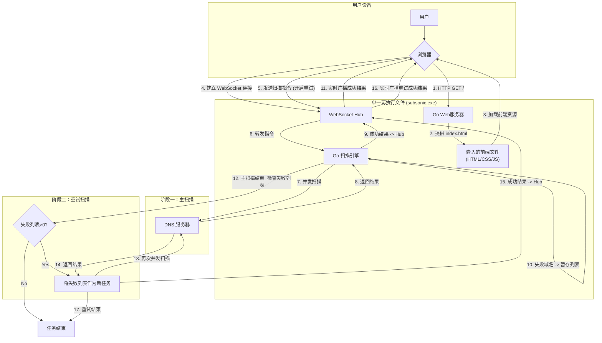

# SubSonic - 高性能实时子域名扫描平台


**SubSonic** 是一款拥有桌面级应用体验、服务器级性能的子域名扫描工具。它将 Go 语言的极致并发性能与现代化的前端技术栈完美融合，并最终编译成一个**单一可执行文件**，实现了真正的“开箱即用”。

> SubSonic: A high-performance subdomain scanner with a desktop-grade user experience. Built with Go and Vue, it features an adaptive concurrency engine, two-phase scanning for accuracy, and a real-time web UI, all packaged into a single, dependency-free executable.

---

## 为什么选择 SubSonic？

Subsonic 在设计上追求极致的用户体验与扫描性能的平衡，其核心优势体现在以下五个维度：

*   **速率 (Rate) - 兼顾速度与稳定**:
    Subsonic 利用 Go 语言的并发原语，能够轻松开启数以万计的 Goroutine 进行扫描。更重要的是，它并非一味追求极限 QPS，而是通过智能调度，在不同网络环境下寻找速度与稳定性的最佳平衡点，实现高效且可靠的扫描。

*   **自适应 (Adaptive) - 会思考的并发调度**:
    内置一套独有的“四区”自适应并发调度算法。它能实时监控网络质量（DNS 解析的重试率），并像经验丰富的驾驶员一样自动“踩油门”或“踩刹车”，动态调整并发数。这意味着您无需再纠结于“并发数应该设置多少”这个难题。

*   **准确性 (Accuracy)**:
    准确性是扫描工具的生命线。Subsonic 采用多项机制来保障结果的准确：
    *   **分层 DNS 解析**: 内置多组高质量 DNS 服务器，并采用分层、随机的策略进行查询，避免因单一 DNS 服务器故障导致的结果偏差。
    *   **智能重试**: 对每个域名进行多次、使用不同服务器的重试，确保结果的可靠性。

*   **错误重试 (Error Retry) - 弥补网络抖动的遗憾**:
    我们独创了“两阶段扫描”机制。在常规扫描结束后，Subsonic 会自动收集所有因瞬时网络波动等原因导致解析失败的域名，并进行一次集中的、快速的二次重试。这个功能可以极大地提升结果的完整性，确保不漏掉任何一个可能存在的子域名。

*   **可视化 (Visualization)**:
    Subsonic 将复杂的扫描过程以最直观的方式呈现给您。通过现代化的 Web 界面和 WebSocket 实时通信，您可以：
    *   **实时查看结果**: 无需等待任务结束，发现的每一个子域名都会立即出现在结果列表中。
    *   **监控扫描状态**: 进度条、并发数、失败率等核心指标一目了然。
    *   **轻松导出数据**: 扫描结束后，一键即可将所有结果导出为 CSV 文件。

---

## 核心特性

### 性能与效率
*   **极致性能**: 利用 Go 语言的 Goroutine 机制，实现数以万计的并发扫描，速度业界领先。
*   **智能自适应并发**: 内置一套经过多轮调优的“四区”自适应并发调度算法，能根据实时网络质量动态调整扫描压力，在保证稳定性的前提下最大化扫描速度。
*   **低内存占用**: 通过 `sync.Pool` 复用对象，有效降低 GC（垃圾回收）压力，确保在高并发下依然能稳定运行。

### 用户体验与易用性
*   **实时反馈**: 基于 WebSocket 的全双工通信，扫描结果、状态、统计数据实时推送到前端，无延迟。
*   **现代前端**: 采用 Vue 3 + Vite 构建，界面美观、响应迅速，提供卓越的用户体验。
*   **单一文件部署**: 整个应用（Go 后端 + Vue 前端）被编译成一个可执行文件，无需安装、无依赖，分发和使用极其便捷。

### 可靠性与准确性
*   **分层 DNS 解析**: 采用多层次、高可用的 DNS 服务器进行解析，并内置智能重试机制，大幅提升在复杂网络环境下的扫描成功率。
*   **网络调试模式**: 提供 `--debug-network` 参数，可打印详细的 DNS 解析日志，便于快速诊断和解决网络问题。

---

## 技术栈

| 分类 | 技术/库 | 作用 |
| :--- | :--- | :--- |
| **后端** | Go 1.18+ | 核心开发语言，提供高性能并发能力 |
| | `net/http` (标准库) | 构建轻量、高效的 Web 服务器 |
| | `embed` (标准库) | 将前端静态文件嵌入到 Go 二进制文件中 |
| | `gorilla/websocket` | 业界标准的 WebSocket 库，稳定可靠 |
| | `miekg/dns` | 强大的底层 DNS 协议库 |
| **前端** | Vue 3 (Composition API) | 现代化、高性能的前端框架 |
| | Vite | 提供极速的开发服务器和高效的打包 |
| | Pinia | Vue 官方推荐的状态管理库，轻量直观 |
| | Element Plus | 提供高质量的 UI 组件库（可替换） |

---

## 系统架构与工作流

SubSonic 的架构核心是“前后端一体化、通信实时化”，并引入了“两阶段扫描”机制以提升可靠性。



**工作流详解:**

1.  **启动与加载**: 用户运行 `subsonic.exe` 并在浏览器中访问。Go 服务器通过 `embed` 包从自身二进制文件中提供前端资源。
2.  **连接与指令**: 前端 Vue 应用加载后，与后端建立 WebSocket 长连接。当用户配置好任务（例如，开启了“失败重试”）并点击“开始”时，指令通过 WebSocket 发送到后端。
3.  **调度**: 后端的 WebSocket Hub 接收到指令，启动扫描引擎。
4.  **阶段一：主扫描**:
    *   扫描引擎调度大量 Goroutine，使用完整字典进行高速并发扫描。
    *   每当发现一个有效的子域名，结果会**立即**通过 WebSocket 推送给前端。
    *   所有解析失败的域名会被暂存到一个内部列表中。
5.  **决策点**: 主扫描阶段结束后，扫描引擎会检查失败域名列表。
6.  **阶段二：重试扫描 (如果需要)**:
    *   如果失败列表不为空，并且用户开启了重试功能，程序会自动进入此阶段。
    *   扫描引擎将失败列表作为新的任务队列，**重新启动一轮**并发扫描。
    *   在重试阶段新发现的子域名，同样会实时推送到前端。
7.  **结束**: 所有扫描（包括重试）完成后，任务结束。用户可以在前端导出完整的扫描结果。

---

## 核心算法与高效机制深入剖析

SubSonic 的高性能并非偶然，它建立在一系列精心设计的、充分利用 Go 语言特性的机制之上。

### 1. Go 语言的并发优势：Goroutine 与 Channel

*   **Goroutines (轻量级线程)**: SubSonic 的核心是 Goroutine。不同于操作系统线程，Goroutine 的创建和销毁成本极低，内存占用仅为几 KB。这使得 SubSonic 可以轻易地启动成千上万个 Goroutine，每一个都作为一个独立的 DNS 查询单元，从而实现真正意义上的大规模并发。
*   **Channels (通道)**: Channel 是 Goroutine 之间进行通信的“管道”，是 Go “不要通过共享内存来通信，而要通过通信来共享内存”哲学的核心体现。在 SubSonic 中，这种“生产者-消费者”模型确保了数据流的清晰、安全和高效。

### 2. 智能自适应并发调度器

这是 SubSonic 最具特色的核心算法之一，它解决了子域名扫描中的一个核心痛点：**如何设置最佳的并发数？并发太低，速度慢；并发太高，会导致大量 DNS 查询超时和重试，反而降低效率**。

我们的自适应调度器通过持续监控**网络质量的核心指标——“重试率”**，来动态调整并发数。

*   **最低并发保证**: 引擎启动时，会保证一个 **150** 的基础并发数（除非用户指定了更低的值），确保了扫描任务始终保持在一个较高的性能基线上。
*   **“四区”动态调整策略**:
    *   **健康区 (重试率 < 20%)**: 网络状况极佳。**策略：+40 并发**，积极探索性能上限。
    *   **压力区 (20% - 50%)**: 网络出现轻微压力。**策略：+20 并发**，采取更稳健的步伐增加并发。
    *   **警告区 (50% - 70%)**: 网络拥堵已较明显。**策略：-60 并发**，温和地减少压力。
    *   **危险区 (重试率 > 70%)**: 网络状况糟糕。**策略：-120 并发**，果断、大幅度地降低并发，以求尽快从拥堵中恢复。

这个模型使得 SubSonic 如同一个经验丰富的驾驶员，在路况好时（网络好）敢于踩油门，在路况差时（网络差）则会主动减速，始终在“速度”与“稳定”之间寻找最佳的动态平衡。

### 3. 分层 DNS 解析与智能重试

为了应对不稳定的 DNS 服务器和复杂的网络环境，我们设计了强大的 Resolver。

*   **分层服务器**: Resolver 内置了两组 DNS 服务器列表：Tier 1（如 `8.8.8.8`, `1.1.1.1` 等，稳定、快速）和 Tier 2（备用服务器）。
*   **智能选择与重试**:
    1.  对于每个域名，前 3 次解析会从 Tier 1 服务器中**随机选择**，以分散压力。
    2.  如果前 3 次均失败，后续的重试会从 Tier 2 服务器中选择。
    3.  总共最多尝试 6 次，每次失败后会有短暂的延迟，避免对单一服务器的过度冲击。
    

这个机制极大地提高了扫描的“韧性”，确保了即使在部分 DNS 服务器不可用或网络抖动的情况下，也能获得尽可能准确的扫描结果。

---

## 如何构建与运行

### 依赖环境

*   Go 1.18+
*   Node.js 16+

### 构建步骤

我们提供了一键构建脚本，它会自动完成前端构建、后端编译和资源嵌入的所有工作。

1.  **克隆项目**:
    ```bash
    git clone https://github.com/yxdm02/subsonic.git
    cd subsonic
    ```

2.  **执行构建脚本**:
    *   **Windows**:
        ```bash
        build.bat
        ```
    *   **Linux / macOS**:
        ```bash
        chmod +x build.sh
        ./build.sh
        ```

3.  **运行**:
    脚本执行完毕后，会在项目根目录下生成一个 `subsonic.exe` (Windows) 或 `subsonic` (Linux/macOS) 文件。直接运行即可：
    ```bash
    ./subsonic
    ```

### 手动构建步骤

如果您不想使用构建脚本，或者希望了解构建的详细过程，可以按照以下步骤手动构建：

1.  **构建前端**:
    ```bash
    # 进入前端目录
    cd frontend
    # 安装依赖
    npm install
    # 打包生成静态文件 (会生成 dist 目录)
    npm run build
    # 返回项目根目录
    cd ..
    ```

2.  **编译后端**:
    完成前端构建后，`frontend/dist` 目录已经包含了所有需要的静态资源。现在，在项目根目录下运行以下命令来编译 Go 后端，它会自动将 `frontend/dist` 目录下的所有文件嵌入到最终的可执行文件中。
    ```bash
    # -ldflags "-w -s" 是一个优化选项，可以减小最终生成文件的大小
    go build -ldflags "-w -s" -o subsonic.exe main.go
    ```

### 命令行参数

*   `--port <端口号>`: 指定服务运行的端口，默认为 `8080`。
*   `--debug-network`: 启动网络调试模式。在此模式下，控制台会打印详细的 DNS 查询失败和重试日志，便于排查网络问题。

---

## 使用指南

1.  **启动程序**后，在浏览器中打开 `http://localhost:8080`。
    
    
2.  在 **“扫描配置”** 区域输入目标域名。
3.  选择一个内置的字典，或上传您自己的字典文件（推荐使用自定义字典）。
4.  **配置并发模式 (重要)**:
    *   **自适应并发 (推荐)**: 勾选此项，让 SubSonic 的智能调度器为您动态管理并发数。这是最省心且通常效率最高的模式，适用于绝大多数网络环境。
    *   **固定并发**: 手动指定一个并发数。适用于您对当前网络环境非常了解，并希望进行精细化控制的场景。**注意**: 设置过高的值可能导致大量超时，反而降低效率。
5.  **开启失败重试 (推荐)**: 勾选此项。程序会在常规扫描结束后，自动对失败的域名进行一次额外的重试，以确保结果的完整性。
6.  点击 **“开始扫描”**。
7.  在 **“扫描结果”** 区域实时查看发现的子域名，并可以在 **“状态栏”** 监控扫描进度（包括主扫描和重试扫描阶段）。
8.  扫描结束后，点击结果区域右上角的 **“导出 CSV”** 按钮，即可将所有发现的子域名和 IP 地址保存到本地。

---

## 许可协议

本项目基于 [Apache License 2.0](LICENSE) 开源。

---

## 总结

SubSonic 不仅仅是一个工具，它更是一次关于“如何将后端高性能与前端高体验完美结合”的工程实践。通过深度利用 Go 语言的并发原语，并结合一套经过反复迭代和优化的智能调度算法，我们成功地打造了一个在性能、体验和易用性上都达到极高水准的现代化网络安全工具。
